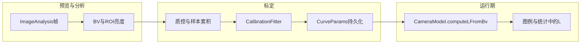

# 相机响应曲线标定：技术方案

## 1. 背景与目标

### 1.1 问题

当前工程使用先验关系将场景亮度（以 BV 表征）映射到显示亮度 \(L\)：

\[
L = 2.9 \times e^{0.729 \times BV}
\]

该式为通用经验系数，未反映具体设备传感器、镜头、ISP、预览管线与显示伽马的差异，导致同一 BV 下不同机型或同一机型不同工况下的 \(L\) 解释存在系统偏差。

### 1.2 目标

- 在应用内提供**标定模式**，引导用户对**均匀灰卡**或**标准色卡**进行多点采样。
- 由应用自动估计**设备特有**的响应曲线参数，形式保持与先验一致：

\[
L = a \times e^{b \times BV}
\]

- 标定成功后，主流程中 BV→\(L\) 的换算优先使用 \((a,b)\)；无有效标定时回退先验 \((a_0,b_0)=(2.9, 0.729)\)。
- 标定参数**持久化**，冷启动后仍生效。

---

## 2. 理论模型与符号约定

### 2.1 BV（亮度值）

在预览分析链路中，由 Y 通道统计量经归一化与对数映射得到场景 BV（实现上与 `CameraModel` / 分析帧一致）。BV 用于表征**相对曝光/亮度层级**，标定即建立 BV 与**应用内使用的参考亮度** \(L_{\mathrm{ref}}\) 之间的指数关系。

### 2.2 参考亮度 \(L_{\mathrm{ref}}\)

标定阶段需要为每个采样点提供一个与“真实相对亮度”单调相关的标量。最小可用实现可采用：

- 中心 ROI 的 Y 均值经线性缩放到合理区间（例如与 \(0\sim100\) 量级可比），作为 \(L_{\mathrm{ref}}\)；或
- 若 EXIF/测光信息可靠，可后续升级为与测光一致的参考（本方案以 ROI 派生为主，便于离线复现）。

### 2.3 拟合形式

对 \(L_{\mathrm{ref}} > 0\) 的样本，取对数：

\[
\ln L_{\mathrm{ref}} = \ln a + b \cdot BV
\]

在 \((BV, \ln L_{\mathrm{ref}})\) 平面上做**一元线性最小二乘**，得斜率 \(b\) 与截距 \(\ln a\)，从而 \(a = e^{\ln a}\)。

---

## 3. 系统架构（与代码对应）

| 层级 | 职责 | 主要类型（工程内） |
|------|------|-------------------|
| 模型 | 曲线参数、BV→\(L\) 统一入口、持久化摘要 | `CurveParams`, `CameraModel`, `CalibrationRepository` |
| 标定数据 | 单次样本、会话状态 | `CalibrationSample`, `CalibrationSession` |
| 拟合 | 对数线性回归与合法性检查 | `CalibrationFitter.fitExpCurve` |
| 呈现层 | 标定状态机、采样节流、质控提示 | `CameraPresenter` |
| 视图 | 开始/采样/完成、曲线来源展示 | `MainActivity`, `activity_main.xml` |

数据流概览：

---

## 4. 标定流程（用户侧）

1. **准备**：均匀灰卡或标准色卡充满画面中心区域，避免强反光与阴影。
2. **开始标定**：进入标定模式，应用提示采样次数与操作节奏。
3. **多点采样**：用户通过调整曝光/ISO/环境光，使 BV 分布拉开；每次稳定后触发“采样”。
4. **完成拟合**：有效样本数与 BV 覆盖满足阈值时执行拟合；成功则写入设备曲线并更新 UI 中的“曲线来源”。

### 4.1 灰卡策略（最小可用）

- 同一灰卡目标，在不同曝光下采集多组 \((BV, L_{\mathrm{ref}})\)，保证 BV 跨度足够（见第 5 节）。

### 4.2 色卡策略（增强，可选）

- **中性灰块**：作为主拟合点，与灰卡策略相同。
- **彩色块**：可用于一致性检查（例如与灰块推导的 BV–L 关系残差过大则标红），不强制进入初版拟合，避免色偏干扰单指数模型。

---

## 5. 采样与质量控制

### 5.1 ROI

- 默认使用**画面中心区域**的 Y 均值，降低边缘暗角与 UI 遮挡影响。

### 5.2 稳定性

- 短时窗口内 Y 均值方差低于阈值才认为“帧稳定”，否则提示抖动。

### 5.3 曝光可用性

- 剔除接近饱和（过曝）与接近全黑（欠曝）的样本，避免钳位破坏单调性。

### 5.4 去重与覆盖

- 采样节流（最小时间间隔），避免连续重复帧。
- 要求有效样本数 \(\geq N_{\min}\)（例如 8），且 \(\max(BV)-\min(BV) \geq \Delta_{\min}\)，防止共线弱约束导致病态解。

### 5.5 标定期与自动曝光的交互（建议）

- 标定过程中可暂停自动微调/或明确提示用户以手动曝光拉开 BV，减少闭环干扰（按产品取舍）。

---

## 6. 拟合算法与失败回退

### 6.1 算法步骤

1. 过滤：`valid` 且 \(L_{\mathrm{ref}}>0\) 且 BV 有限。
2. 检查：样本数与 BV 跨度。
3. 线性回归得 \(b\)、\(\ln a\)，\(a=e^{\ln a}\)。
4. 合法性：`a>0\)，\(b\) 有限且 \(|b|\) 不超过经验上界（防止发散）。

### 6.2 失败处理

- 拟合失败：不覆盖已有曲线，提示原因（样本不足、BV 变化过小、参数非法），可继续使用先验或历史标定。

### 6.3 稳健性增强（后续迭代）

- 加权最小二乘（权重与稳定度相关）。
- 残差过大样本剔除后重算（RANSAC 或迭代删点）。
- 贝叶斯收缩：将 \((a,b)\) 向先验 \((a_0,b_0)\) 收缩，减少小样本过拟合。

---

## 7. 持久化与版本

- 使用 `SharedPreferences`（或等价存储）保存当前生效 `CurveParams`（`a`, `b`, `source`, `updatedAt`）。
- 可选保存最近一次标定会话摘要（样本数、时间）便于排障。
- 若未来多镜头/多分辨率策略分化，可增加 `cameraId` 或 `profile` 键区分。

---

## 8. 验证与测试

### 8.1 单元测试

- 合成无噪声样本：应能恢复已知 \((a,b)\)（容差内）。
- 样本不足、BV 跨度过小：应返回失败。

### 8.2 现场验证

- 同一场景标定前后，图例中 \(L\) 与主观亮度一致性。
- 重复标定参数波动是否在可接受范围。

---

## 9. 与 README/产品说明的衔接

建议在用户可见文档中简要说明：标定为**设备相对标定**，不替代实验室光谱辐射定标；标准色卡模式为增强项，首版以灰卡+中性块为主即可保证可落地性。

---

## 10. 参考实现位置（本仓库）

- 参数与模型：`app/src/main/java/com/example/camera/model/calibration/CurveParams.java`，`CameraModel.java`
- 拟合：`app/src/main/java/com/example/camera/model/calibration/CalibrationFitter.java`
- 持久化：`app/src/main/java/com/example/camera/data/CalibrationRepository.java`
- 流程：`app/src/main/java/com/example/camera/presenter/CameraPresenter.java`
- UI：`app/src/main/res/layout/activity_main.xml`，`MainActivity.java`
- 单元测试：`app/src/test/java/com/example/camera/CalibrationFitterTest.java`

---

*文档版本：与工程内标定实现同步撰写，用于研发与评审。*
